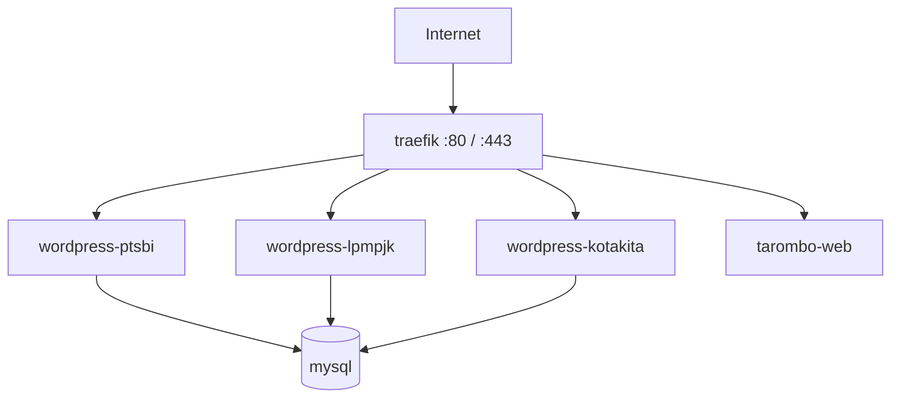

# Standar WordPress di server vm21197

Semua situs WordPress baru **harus sejajar** dengan **ptsbi.org** dan **lpmpjk.org**: satu container per domain, satu database di MySQL bersama, routing & SSL lewat **Traefik**.

---

## Arsitektur (tetap)



| Komponen | Lokasi | Catatan |
|----------|--------|---------|
| Traefik | `/home/togaa/traefik/` | Satu untuk semua site |
| MySQL | `/home/togaa/mysql/` | Satu container, banyak database |
| WordPress | `/home/togaa/wordpress/docker-compose.yml` | **Semua** service WP di file ini |
| Tarombo (bukan WP) | `/home/togaa/tarombo-app/` | Pola Traefik sama, image beda |
| IP publik (IPv4) | `5.175.245.78` | DNS: record **A** `@` dan `www` |

---

## Penamaan (wajib konsisten)

Ganti `SITENAME` dengan slug pendek (huruf kecil, tanpa spasi), mis. `kotakita`, `ptsbi`, `lpmpjk`.

| Item | Pola | Contoh kotakita.net |
|------|------|---------------------|
| Service di compose | `wordpress-SITENAME` | `wordpress-kotakita` |
| Container | sama | `wordpress-kotakita` |
| Volume Docker | `wordpress_SITENAME` | `wordpress_kotakita` |
| Volume di disk | `wordpress_wordpress_SITENAME` | `wordpress_wordpress_kotakita` |
| Database MySQL | `wp_SITENAME` | `wp_kotakita` |
| User MySQL | `SITENAME` | `kotakita` |
| Router Traefik | `SITENAME` / `SITENAME-www` | `kotakita`, `kotakita-www` |

---

## Langkah: situs WordPress baru

### 1. DNS (registrar / idcloudhost / Namecheap)

| Tipe | Host | Nilai |
|------|------|--------|
| A | `@` | `5.175.245.78` |
| A | `www` | `5.175.245.78` |

**Tidak** perlu nameserver khusus VPS — cukup A record (kecuali pakai Cloudflare).

### 2. Database MySQL

```bash
ssh vm21197
docker exec -it mysql mysql -uroot -p
```

```sql
CREATE DATABASE wp_SITENAME CHARACTER SET utf8mb4 COLLATE utf8mb4_unicode_ci;
CREATE USER 'SITENAME'@'%' IDENTIFIED BY 'PASSWORD_KUAT_UNIK';
GRANT ALL ON wp_SITENAME.* TO 'SITENAME'@'%';
FLUSH PRIVILEGES;
EXIT;
```

### 3. Tambah service di `docker-compose.yml`

File: `/home/togaa/wordpress/docker-compose.yml`

Salin blok dari `templates/wordpress-service.yml.example` (di folder ini), ganti placeholder.

Pastikan di bagian bawah file ada:

```yaml
networks:
  traefik:
    external: true

volumes:
  wordpress_SITENAME:
```

### 4. Deploy container

```bash
cd /home/togaa/wordpress
docker compose up -d wordpress-SITENAME
docker ps | grep wordpress
```

### 5. Restore backup atau instalasi baru

| Sumber | Langkah |
|--------|---------|
| Backup `.tar.gz` | Upload ke `~/SITENAME-restore/`, extract, import `.sql`, copy `wp-content` ke volume |
| Instalasi kosong | Buka `https://domain/` → wizard WordPress |

Path volume (untuk copy file):

```bash
docker volume inspect wordpress_wordpress_SITENAME --format '{{.Mountpoint}}'
```

### 6. `wp-config.php` (setelah restore)

Di volume site, pastikan:

```php
define( 'DB_NAME', 'wp_SITENAME' );
define( 'DB_USER', 'SITENAME' );
define( 'DB_PASSWORD', 'PASSWORD_KUAT_UNIK' );
define( 'DB_HOST', 'mysql' );
define( 'WP_HOME', 'https://domain.com' );
define( 'WP_SITEURL', 'https://domain.com' );
```

```bash
docker restart wordpress-SITENAME
```

### 7. Tes sebelum DNS (opsional)

Di laptop, `C:\Windows\System32\drivers\etc\hosts`:

```text
5.175.245.78  domain.com www.domain.com
```

Buka `https://domain.com` → harus tampil site dari server Anda.

### 8. SSL

Traefik + Let's Encrypt otomatis setelah DNS mengarah ke server dan router Traefik benar. Cek:

```bash
cd /home/togaa/traefik && docker compose logs --tail 30 | grep -i acme
```

---

## Checklist per site baru

- [ ] Database `wp_SITENAME` + user dibuat
- [ ] Service ditambah di `wordpress/docker-compose.yml`
- [ ] `docker compose up -d wordpress-SITENAME`
- [ ] Restore / instal WP selesai
- [ ] `WP_HOME` / `WP_SITEURL` benar
- [ ] DNS A record aktif
- [ ] HTTPS jalan
- [ ] Purge cache (jika LiteSpeed terpasang)

---

## Site yang sudah ada

| Domain | Service | DB |
|--------|---------|-----|
| ptsbi.org | `wordpress-ptsbi` | `wp_ptsbi` |
| lpmpjk.org | `wordpress-lpmpjk` | `wp_lpmpjk` |
| kotakita.net | `wordpress-kotakita` | `wp_kotakita` — live, tunggu DNS A |
| *(hosts)* wp-belajar.local | `wordpress-belajar` | `wp_belajar` |
| *(hosts)* project-coba.local | `wordpress-project-coba` | `wp_project_coba` |

Detail: `BELAJAR-WORDPRESS.md`

---

## Bukan WordPress (Tarombo)

Aplikasi custom = service terpisah di `tarombo-app/`, tetap network `traefik`, label `Host(\`tarombo.ptsbi.org\`)`. **Jangan** campur ke `wordpress/docker-compose.yml`.

---

## Kesalahan umum

| Salah | Akibat |
|-------|--------|
| Edit file di `/home/togaa/wordpress/` saja tanpa volume | Website tidak berubah |
| Lupa `networks: traefik: external: true` | Container tidak lewat Traefik |
| Dua site pakai database sama | Data tercampur |
| Ganti NS tanpa A record | Domain tidak ke server |

---

## Script bantu

| Skrip | Fungsi |
|-------|--------|
| `scripts/cleanup-sandbox-failed.sh` | Hapus belajar saja (kotakita/ptsbi/lpmpjk aman) |
| `scripts/deploy-belajar-fresh.sh` | WordPress sandbox belajar |
| `scripts/deploy-project-coba.sh` | WordPress project-coba |
| `scripts/new-wp-site.sh` | Cetak SQL + ringkasan variabel |

Panduan bersihkan: `BERSIHKAN-SANDBOX.md`

---

*Server: vm21197 · User: togaa · IPv4: 5.175.245.78*
